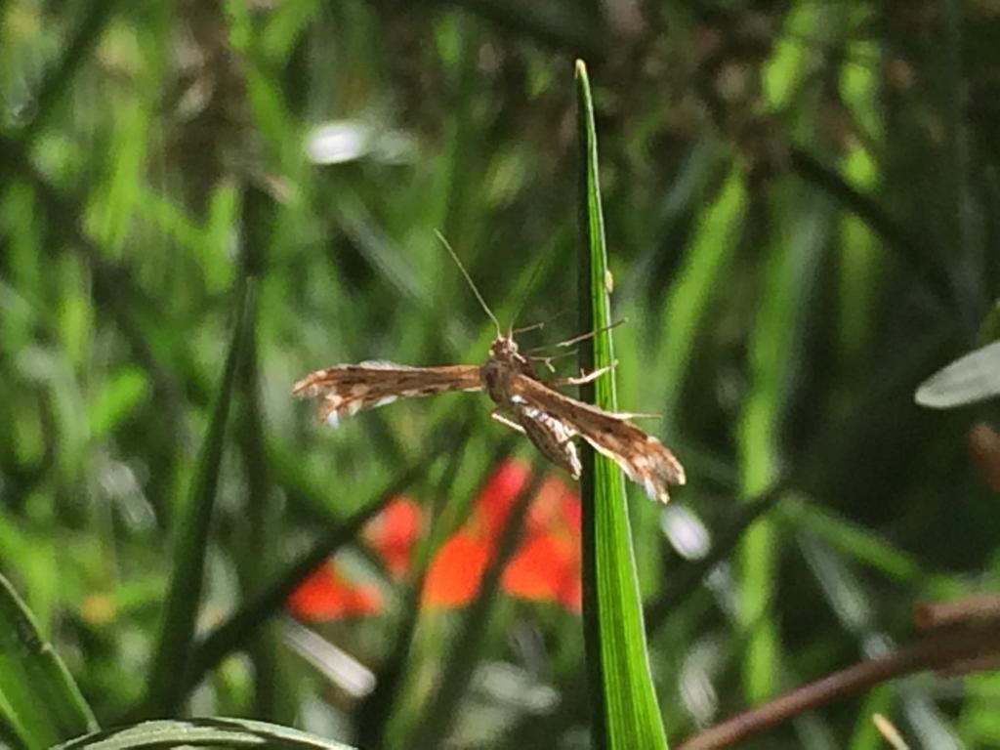

# Hi!

     
    <em>Picture of an insect, taken in my garden.</em>

 

Hi, my name is Isabel Marx, I live in Santiago, Chile, and am currently studying Electrical Engineering, with my eyes set on being a Machine Learning Engineer and a Data Scientist🤩.
  

 

    
    
    
    

## About me 🐣

 

- 🤖 I'm interested in Machine Learning, Voice Processing and MLOps.
- 🏫 Currently finishing my Electrical Engineering studies in the University of Chile, hopeing to apply for a master's in Data Science soon.
- 👩‍💻 My internship this summer working for Cenia was really fun!
- 🛸 I did my first internship at a drones company in Berlin, Germnay.
- 👩‍🏫 I'm a volunteer at Niñas Pro, teaching programming classes to girls ages 10 to 18.
- 🐶 I've volunteered caring for, vaccinating and sterilizing street dogs and cats, at Abandonados Parque O'Higgins.
- 🐮 Be it personally or online, I spend a lot of my free time doing Animal Rights Activism, specially those animals exploited in the agricultural system.
- 🥦 I've been vegan for 7 years.
- 👩‍🍳 I like to cook and particularly bake. I love sweets!
- 🪲 I've developed a new-found love for insects. I hope to learn more about Entomology in the future.

 
 

## Tech Stack 🛠️

Programming Languages

Data Science and Machine Learning Frameworks

![GeoPandas](https://img.shields.io/badge/GeoPandas-0F9C5A.svg?logo=data:image/png;base64,iVBORw0KGgoAAAANSUhEUgAAAOEAAADhCAMAAAAJbSJIAAAAllBMVEUPnFr///9Hq3cAl1DiHIT+yQUAlk2y18EAlEnU6t4Al08Amlbz+PWWy67U6Ny73coAmlwAn1jC4M+WsT1XsoLe7eSBb23oEIa8S3qmWHWTanBPrnzyxhTm8+w2pm0Anllxu5MloWSo07tmtouLxqWAwZ1htIfI49Tt9vGh0LaTyat4vpc8pm4AjTcAkUJsfGhfgGZ6eGtr1GI2AAANBklEQVR4nO2d6XbqOBaFDeo2woKiLg090eFiMHMq1f3+L9eG3CRY2udosGRCVvafWqtuLOtD0xlkKet/cW0y9cXVz764vgkfX9+Ej69vwsfXN+Hj65vw8dURYW0eCpHXkrXq/xSFEPX/6+TViQkvYDLPFqvqOJjsh/NX7aeT9Wm7WwqZFyIxZ0JCJQqZL7br4aFHajSfjDeZzBNiJiJUKpfP1eSJZmtwDo87IRNRpiBUQi6rvRvch+brXZ6LBLWJTagKOVsz/ZLVfpvJ2JBxCevWm01GgXivGlZZHrW7xiRUsly3w/vVkquYYzIeoZDnYQS8q0brUsZijESoCnWM0Xwf2s8iMUYhVHk5iIp31dMqCmMEwppvEp/vosM5AmN7wiIV35WxfTu2JRRinY7voqdFS8Z2hEpWafku2pfF3Qhl39HwbKljm2ZsQahEggkU6zCTdyCUm7gLIK9JsJUTSqiKhDMo0ii0GQMJ84VfAx6Gk3V13sz6z7X6i925dvn3noN4HTYawwjl0f233x9XS3mJVojbpJ4QRS5ltjtN3TmfyhDPKoRQKUcT+zA4l5cIBf3bK5FLtTvOHRlXAT01gLDoO/XQYVXKwqlf1V6lWrm5lQN/RH9CuXWoyf4s/KJLqpCLgQPk3DsE6U0o7VbaU6VC3PQacmeP7oyWnkV7EqrcOgQn/XALpP5lxtaGnPkZcX6EStlmvmNQ891IyJVt3jl7DUYvQlXyP/DoVESIlCm5s3SUkw+iD6EN8BQr3Fkz8n3l6IHoQaiW7FvXImKkU8kV+2uu3RHdCXnAYTsnzpSQ4ziIzoSqZN432kQL/n2oKLnh6NxRXQlZwEHcKPX7O+WZeenYEdGRUCl6WAT7NXaJjDEBqtyt6m6EOT23TZOmODkbceM0tbkRSnpEbJM14KvEkk5k9V1+WydCSQZkRssEGT+thjndU0sHRBfCggwZDt3co5ai142Dw1B0IFQz6gUB3lqQ8g1Vg729BnZClVHFVx0B1oPxmarD2NqKdkJJmfort9k6imiTeGYbJ1ZC0uPdRTbTeClFTaltCdWOKHiRfBLVKkK5psMXy4M2wk8CWM/o1JJV8Z3JQiiJtWjXOWBGZ0n4yA1PKAjTd9PpGPxVF5LwiZ3TeUKij25bzqLGZy0uDzGZrjH3g7OERB/1cLDxO2e6lg5Pcbk8znrjCIl51MGO4CXNRnAY1hzhkKkSRyjhKutiC/Iyy21L2FvRBTCEBU4wudjzvBIQjuiRyLUhLMvN7WSVgLB3JBFpQgmTvDHciRSEPfI5klBBc/4Qw51IQjihpgeSEAcufBM/uOgUhGTVKELVR6WwS6uz0hBSixhFCJuQN4+clYaw94wbkSDETegU27IrESHRiAQhtNdihWUSERIrNSbEWZhYcbVUhBM4S2BCuOGpiuUTpiLETUC0IXg8ylJ4VTJCWAwkFCfw+Cpa8DcZ4Qg1AiSUIK4VaaW4Fp+KsLcBrYAIYZAbPRyodITIT0SE+dR8Nt4oTEmI7G9EKMCj24jBtYSEoCBAqEBSEo7hUCUkBLMFIEQbu1yq4KxYhMh0Nj0M1IbgwShkb4pFuAd2ydEoySQUoJPuo6aZorXhwqyp2U1NQpRU3kVN9UYj/AMEAw3zGxCaT0WdZyISvoBooGE9G4QoDLyOm4eJRiiBC/SbPqAMQvSlViTP903RCHMJcopWQvBQTHvm+opohALs0tDnDLOXms8MQjrp9RSMW30UwhHSjyFC5Knr64VOqFb2X8UJcPw0b2ry/maGUAyGmm7+ySREXtBQ66Y6IRqGIZ0U1sdOmP+m/9N7aAKWiEw5rbo6ITDZgpb7jggV2EukzYsGofnEKWgYdkOIpo2KJUTZiqC1oitCsJ9JC7nphGBrQtBa0RUhmDfmzQprhOABfW5qTygm06b271Eu/14K5n6WEJjdYSYbR5iJQtP7OPAnLE3Cpo+oEYL1JSyKyBLS8iZEmw02HCEI0YSlDDsjBMtbc/JvEiIrKMz57YwQbHcbNCZTjdB0nQIjwZ0RCnOLdtOBahKCCEZgAKMzQmDVNBtFIzSd5kDvtztCc2CNOEKzUwfZbB0SIjuTmWkKczkMTDl1R2jukmvGPpuEYOq17hQPIPzdUBtCcwlv7FloEoIQRuAOGo7w9//8VdPf3hBDeqlpe88YQvP3COLrlNAcWRuG0DSBAsNs3REWZi7wzBAaf9wLDJV2SGhmLxqpQCthYMaiQ0Jzhau+FiFwaf0IA6PBD0T49dvw0xN6jkNztXjIudRrxf/866HFlrZabeVnJwS2NGfTmDbeF7NLwe8RmMLvjhCMrCVNaLPxPiWhUWXOPwRrS+BeoQ7XQ5OQ8fFB1jgoAdwhIdhzz8VpQGImLG3RYSTKTFzMOUJzZ2ngNoVQQmNinNripWa3awZAtah+afx5oFETSKie9Zvv3j8vpWLepkkzYMYhCs0Rn6KkIWQ+EaYyM+ZyWLG5J9Oo2XZK6F0iaJMdRwiMvLDJtCtClEtqPqdn18yw/jx6ljtMRJYb7BVlc8AoaRw9yx0mXCKYaObNF+mEpUkYFPXuihBMHNqw0vfTAB84yG4LzOP7l2i2yJbdT4O8i99i7/oSA20vxtQl/YP3RIHdMUueEEw1vZBPYwP302Q/f2j6yZaIPrKz7GtDXwSFJNgCCX/++XdN//3JlQgGlZ60NvcIm4T4y8UkhD/++Q9N//rBlKjAbn192jD3CIPvNAIGYjjhXxriCV22bJttCAZiQCSjG0L0GaHeHOYuaPAVd0A37YRQgk461etqfm+Bzmz5pIQvYIew4SiYhGgC9g9HdUL4h1lTM2dtEqKNxf7WdxeEe1BT8ytS9HUe+GW848KdEIJp3/ykHhCCoKm2Ge6TEKJD+MyaoO8P0Vman7ENgcCnzug7YDSb+joYdyIEnyvDL53RcZee3t2dCEE7wO/x0QFKnqdi3IcQmSb4TAVwKOvIrxHvQ4g+DYGEyK/0HIl3IYT7mfHZJmhJ9JtOu/CeDMFjETAhcjB6A59+GuoB/+/fmv6kPWBDsILUOVGoAB/Dposohi7zW3yGEB5py50wGYvQp0Rdfmd9laiIs/tkcwfCNbYsqfPacnhqons3vQMh8Rx55l6JCpk699PuCYkmpM9NzGGBzicNdU9I1Yw5vxSWkzkidk6IJ1KWEB9B6zqfdk5ILtbcKbvwGOGj27rfNSF9yhNDSBxX7nYceyihkcdXdIk3Yr6wY8+Cxvc+OB2VHEjotdvkRsz35ux53viWLqfjrkMJfXYM3fxR4HneWY7vtnCZbbol5AYOf64+ygtYfrJ7EDLnldsIUfbqIvulZ10S8sfgW+63IPqp/Y5FltAorh0hP/PZ7ihB5xRdZLsniCNUC13vm9cYwgIdOXqRJfdnvYWFuvXQgsjuxaA3r9GEgqqI7XRj611BaNPRVXxHjb2/VMDDqXsOX9M73PcE0hhXsRd5RCYsyHvDrPaHw61kxJLBe4txCemrHu1XNbjcu1ZSxc/pqw+jEtJXuTvc1elyd54guwh9OWBEQuZ6QJcLYZzuP6SvByTvc49H+FKSVzw+OW2sdiHkrhsf4FtkoxEOyJsBHQMOboTk3V2XH3KJQkDRCJmLj90i1I6E3E2kverFfFU0QloLt5CRKyF3m2xvbl7onJ7Q9eo3Z8JMcJeBH/XRmJxw5bp3wp2QvmPxooN2b3VqQmdAD0L6jsVfBM+3jIkJ3QF9CDMlqCtJXzVdSiYyFpNw45HK9CHkZ9QmY1LCmU/C3Y+QuMjrlmP2ypiS8NlrR4EnIWMEv+mpErkKI1TixU54cE2dBBIyjsyHJjNpbv20EipZjrnp+lcxvhdlexPS3vatRmvDb2YJlZBZZRnkV/nfn+lPWHcSfkolRBIqkcvF0a1MypWJS1h3J9rV8CJUShSymI1ps76pQ8hd9SGE9WBkXBqS8KUQHypyKdVyM56yVkRTkzzkG7MwwkxkLoOmodF0cByftrWq03g92c8ZvwgqoIe2IKybkfb7k2iYBZ4jE0yYidK7GVtoi0MJSQnrCYcKFkfXPrQB2xHWzahsRlwUHXZtLmdoRViPxn7Q2uilU3AHjUFYd9WV3dJqo4FqeUFKW8ILY+U777trWrb8PjoGYT0cUzHeutR3JbwwbuP31UEZZMPoikN4YdxFXR5HY+XrJhGKRXgZj8t1rM46XMloFzDFI7y6QStXN4HRYVxGGH4ftYpIeCkuV9tWvfWw7ks6KxlUpbiEtUSuzlRi3KL5+DkyXpaC8FJoIftjz6Z8GqxUfLwsEWF2HZN5v5o4+bej4XGjZKSp06xJIsJr2XVbiufzcUo6u0/DQbXLZJ6i7d5rkZDw9QWXWIwUZX9zPh2P60Gt9fo43q5my0xe2BLCvVYgNeHbe2pd4zO1roEalRzt7c0dEd5P34SPr2/Cx9c34ePrm/Dx9U34+FL9/wPsvBbZ6tJC/AAAAABJRU5ErkJggg==)

Enviroments, Containers, Deploy, CI, etc.

Cloud

Others

